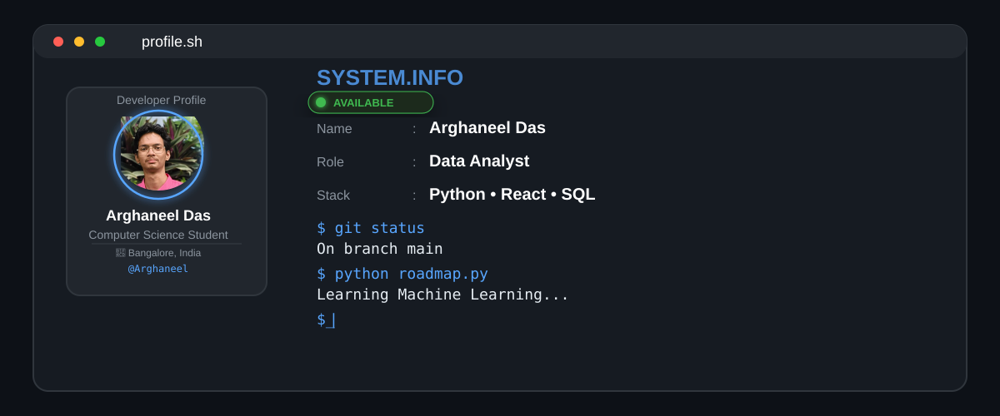

<div align="center">



</div>

---

```bash
$ ssh arghaneel@github

Connected...

Welcome to Arghaneel's GitHub Profile

Last Login: Today
---

```bash
$ cat about.txt
```

```txt
Name      : Arghaneel Das
Role      : Computer Science Student

Education : Atria Institute of Technology
Location  : Bangalore, India

Focus     : Data Analytics
Learning  : React, Next.js, Python, SQL

Mission   : Build practical software and AI-powered
            solutions that solve real-world problems.
```

---

```bash
$ tree skills
```

```text
skills
├── Languages
├── Frontend
├── Backend
├── Database
└── Tools
```

<div align="center">

### Languages


### Frontend


### Backend


### Database


### Tools


</div>
---

```bash
$ github stats
```

<div align="center">


</div>

---
## 🔥 GitHub Streak

<p align="center">
  
</p>

---