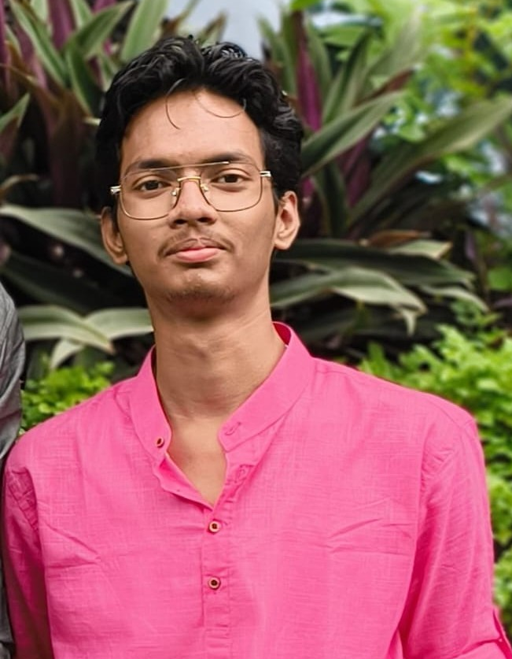

# Hi 👋, I'm Arghaneel Das

### 💻 Computer Science Student • 📊 Data Analytics Enthusiast • 🚀 Open Source Learner

  

---

## 🚀 About Me

- 🎓 Computer Science Student at **Atria Institute of Technology**
- 📊 Interested in **Data Analytics** and **Software Development**
- 🌱 Currently learning **React, Next.js, Python, SQL**
- 💡 Love building real-world projects
- 🚀 Always learning new technologies

---

## 🛠️ Tech Stack

### Languages

### Frontend

### Backend

### Database

### Tools

---