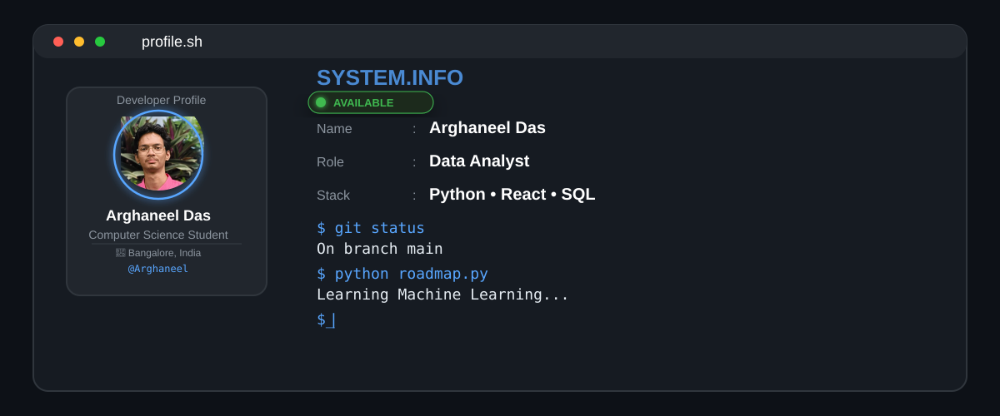

<div align="center">



</div>

---

```bash
$ ssh arghaneel@github

Connected...

Welcome to Arghaneel's GitHub Profile

Last Login: Today
```

```bash
$ cat about.txt
```

```txt
Name      : Arghaneel Das
Role      : Computer Science Student
Education : Atria Institute of Technology
Location  : Bangalore, India
Focus     : Data Analytics
Learning  : React, Next.js, Python, SQL
Mission   : Build practical software and AI-powered
            solutions that solve real-world problems.
```

---

```bash
$ tree skills
```

```text
skills
├── Languages
├── Frontend
├── Backend
├── Database
└── Tools
```

<div align="center">

### Languages


### Frontend


### Backend


### Database


### Tools


</div>

---

```bash
$ github stats
```

<div align="center">


</div>

---

```bash
$ ls projects
```

```text
projects
├── Jeevandhara
├── SixthSense
├── Portfolio Website
└── Carbon Grove
```

---

```bash
$ git log --streak
```

<div align="center">

<a href="https://git.io/streak-stats">


</a>

</div>


```bash
$ github activity
```

<div align="center">


</div>
### 🏆 GitHub Achievements

[](https://github.com/Arghaneel?tab=achievements)
```bash
$ snake --contributions
```

<div align="center">


</div>

---

```bash
$ contact
```

<div align="center">

<a href="https://www.linkedin.com/in/arghaneel-das-690b4b355">
  
</a>

<a href="mailto:arghaneeldas29@gmail.com">
  
</a>

<a href="https://github.com/Arghaneel">
  
</a>

</div>

---

```bash
$ shutdown now
```

```text
Saving session...

Logout successful.

See you in the next commit. 👋
```
